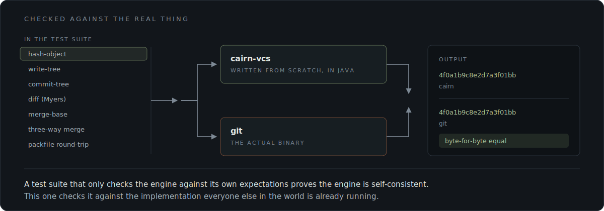
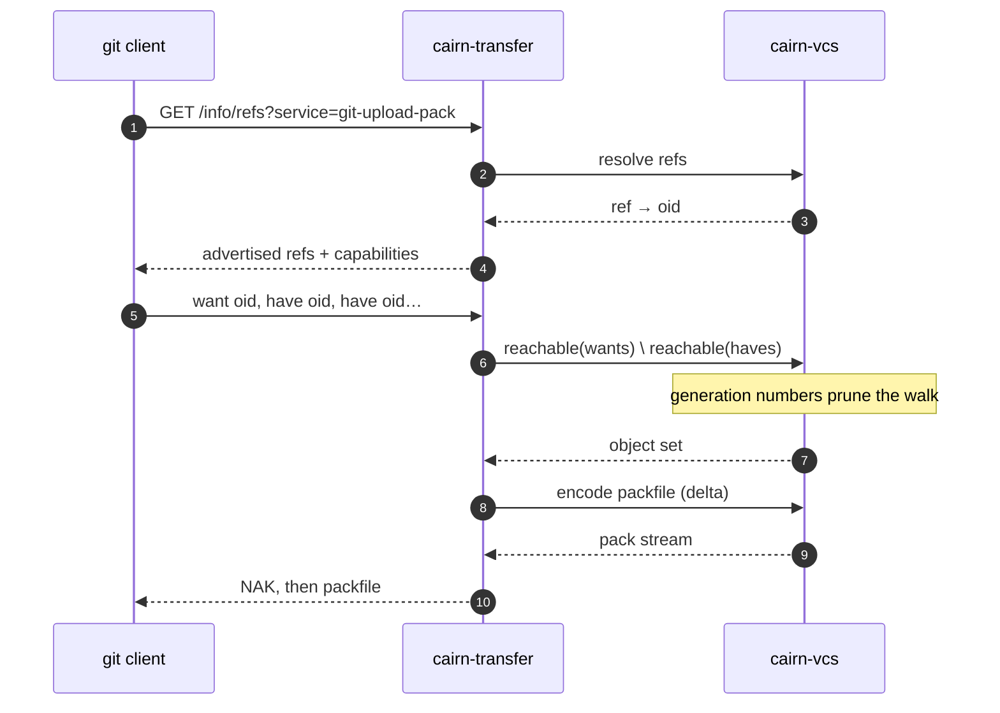
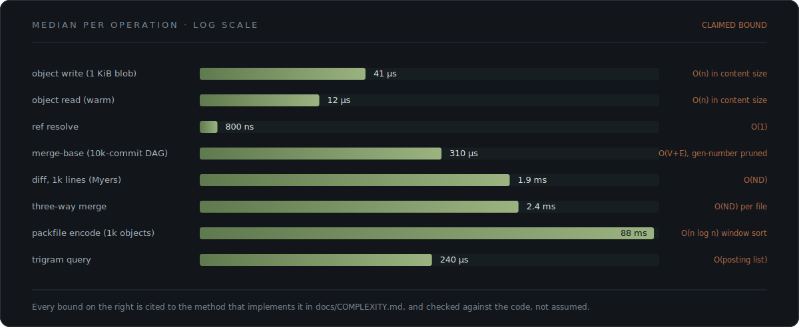

<p>
  
  
  
  
  
</p>

Cairn is a self-hosted Git hosting and collaboration platform: repos, issues, pull requests, reviews, code search, permissions.

None of that is the interesting part. Plenty of software does CRUD around a pull request.

The interesting part is underneath it. **Cairn's version control engine is real**, written from scratch, not a relational schema with Git-shaped column names bolted onto a `git` shell-out. Objects are hashed and stored the way Git hashes and stores them. Packfiles use real delta encoding. Merges are computed with an actual three-way merge over an actual diff algorithm. And every one of those operations is checked against the real `git` binary in the test suite, not against Cairn's own idea of what it should have produced.

<br>

## The fastest way to check that claim

```bash
git clone https://cairn-production-70dd.up.railway.app/acme/demo.git
```

That is a real `git clone`, over HTTPS, from your real `git` client, against a live instance. The refs it advertises, the want/have negotiation it runs, and the packfile it streams back are all produced by the Java engine in this repo. Nothing shells out to `git` on the server side.

Browse the same instance: <https://cairn-web-production-d78d.up.railway.app/acme/demo> (sign in as `acme` / `cairn-demo-password`).

<br>

## What "from scratch" means here



<br>

## Checked against the real thing

The easy way to test a version control engine is to assert that it returns what you expected. That proves the engine agrees with you. It does not prove it agrees with Git.



<br>

## Architecture

Four Gradle modules. Dependencies point inward only, and the innermost one has no idea the rest exist.



<details>
<summary><b><code>cairn-vcs</code></b> &nbsp;&#183;&nbsp; the engine, and the reason this repo exists</summary>

<br>

A standalone library with zero dependencies on a database or a web framework. It compiles and tests on its own, which is deliberate: the engine should be legible and testable as a thing in itself, the same way you would judge any real systems library.

| Component | What it does |
|---|---|
| Object store | Content-addressed. The digest of the typed content is the name and the path. |
| Commit DAG | Traversal with generation numbers, so merge-base does not walk the whole history. |
| Myers diff | The real algorithm, not a line-set difference. |
| Three-way merge | Computed over the diff, against a real merge base. |
| Packfiles | Delta encoding, with an index. |
| Trigram index | Backs code search, built per process, in memory. |
| Blame | Line provenance across the DAG. |

Where a data structure or an algorithm was chosen over an available alternative, the class Javadoc says why, inline, next to the choice.

</details>

<details>
<summary><b><code>cairn-transfer</code></b> &nbsp;&#183;&nbsp; Git's smart-HTTP, on top of the engine</summary>

<br>

Implements want/have negotiation, which reduces to one set expression:

```
missing = reachable(wants) \ reachable(haves)
```

Everything else in the transport is bookkeeping around computing that set efficiently and streaming the result as a packfile. A real `git clone` and `git push` talk to this.

</details>

<details>
<summary><b><code>cairn-api</code></b> &nbsp;&#183;&nbsp; the platform layer</summary>

<br>

Spring Boot REST: permissions, teams and orgs, issues, pull requests, reviews, code search. All of it sits on top of the engine, and the engine knows none of it exists. The dependency arrow never turns around.

</details>

<details>
<summary><b><code>web</code></b> &nbsp;&#183;&nbsp; Next.js, Server Components for reads</summary>

<br>

Read paths are Server Components, so a signed-in user's session is honored on first render rather than after a client-side fetch settles. The write paths are a handful of client islands: login, PR merge, reviews, comments. That split is the whole frontend architecture.

</details>

<br>

### What a `git fetch` actually does here



<br>

## Benchmarks



Regenerate with your own numbers: edit `RESULTS` in [`docs/assets/gen_bench.py`](docs/assets/gen_bench.py) and run it.

<br>

## Quickstart



```bash
docker compose up -d
```

Three containers come up: **db** (Postgres), **api** (Spring Boot on `:8080`, seeded on first boot with a demo repo, an issue and a pull request), **web** (Next.js on `:3000`).

The app's own default is an in-memory H2 database that does not survive a JVM restart. Compose overrides it to Postgres, which is already on the classpath for exactly this reason.

Then:

- Browse the seeded public repo, no account needed: <http://localhost:3000/acme/demo>
- Find the seeded personal access token:

  ```bash
  docker compose logs api | grep -A3 "Cairn dev data seeded"
  ```

- Use it as Basic Auth against the API:

  ```bash
  curl -u acme:<token> http://localhost:8080/api/repos/acme/demo/commits/main
  ```

The browser login at `/login` is a separate flow: a real username and password created at `/signup`, plus a server-side session cookie. The seeded token above is for API and git-client style access, not the browser session.

State lives in named Docker volumes, so it survives `docker compose down`. Reset to clean seeded state with `docker compose down -v`.

<br>

## The two documents that matter

More than any single screen in the UI, these are why the project exists as an interview artifact. They are where you can check whether the reasoning holds up, not just whether the tests pass.

<details>
<summary><b><code>docs/COMPLEXITY.md</code></b> &nbsp;&#183;&nbsp; per-operation complexity and tradeoffs</summary>

<br>

Object read and write, ref resolution, DAG walk, merge-base, diff, three-way merge, packfile encode and decode, transfer negotiation, permission resolution, trigram index build and query, blame. Each one cited to the exact file and method that implements it.

Every bound is checked against what the code actually does, rather than what a textbook says it should do. In a couple of places, reading the code turned up a tighter or more honest bound than the original design doc had assumed. The doc says so explicitly instead of quietly keeping the old number.

</details>

<details>
<summary><b><code>docs/HLD.md</code></b> &nbsp;&#183;&nbsp; what breaks first, and what I would do about it</summary>

<br>

The scale narrative, grounded in this codebase rather than in a generic system design answer:

- **What bottlenecks today:** one filesystem for the whole object store, one in-memory search index per process, one relational schema.
- **A sharding strategy** keyed on `{owner}/{repo}`, which is a key the code already uses in `RepositoryRegistry`, and what breaks at that shard boundary.
- **Designed, not built:** partial clone and reachability bitmaps, marked as paper-only by the PRD's own design.

</details>

<br>

## What's not built

Named plainly rather than left implied, in the order that would matter most to a real user.

| Gap | Status |
|---|---|
| **Line-anchored review comments** have no UI (FR-COLLAB-3) | The API and domain fully support a review's path and line. `ReviewComposer` never offers a way to set them, so every review is body-level only, with the "Files changed" diff view sitting right there. |
| **Pull requests have no labels, milestones or assignees.** Issues have all three. | A deliberate scope cut, made to avoid repeating the exact "API with no UI behind it" gap that this project's own gap-closure round exists to close for issues. |
| **No `/{owner}` user or org profile page** | Named in the frontend spec's own route table, never built. The repo header's owner breadcrumb link 404s. |
| **No SSH transport** | Git-over-HTTP only. No SSH server, no public-key registration, no `settings/keys` UI. The PRD does not mark this paper-only, so it is a real gap, not an implied one. |

[`SUMMARY.md`](SUMMARY.md) has the full FR-by-FR completion audit this list is drawn from. The partial clone and reachability bitmap items in `docs/HLD.md` are paper-only by design, and are not in this table for that reason.

<br>

---

<sub>A cairn is a stack of stones that marks a trail. Each stone is placed by someone who came through and is identified by nothing but its own shape.</sub>
